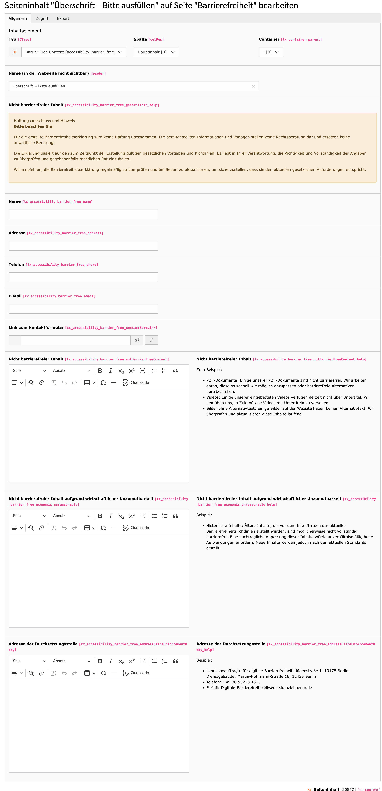
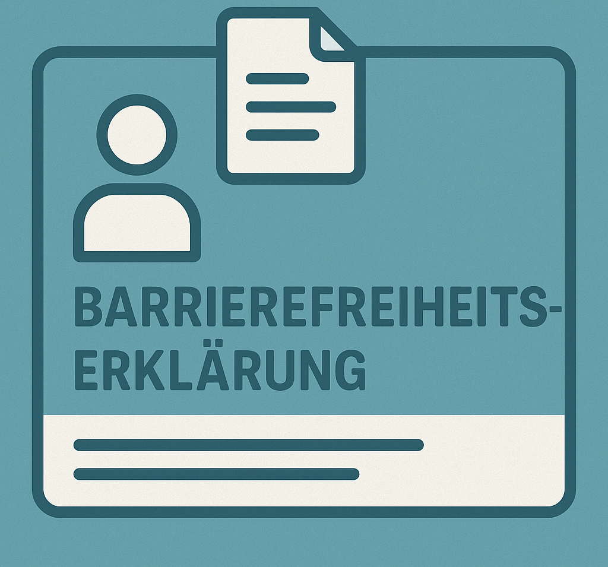
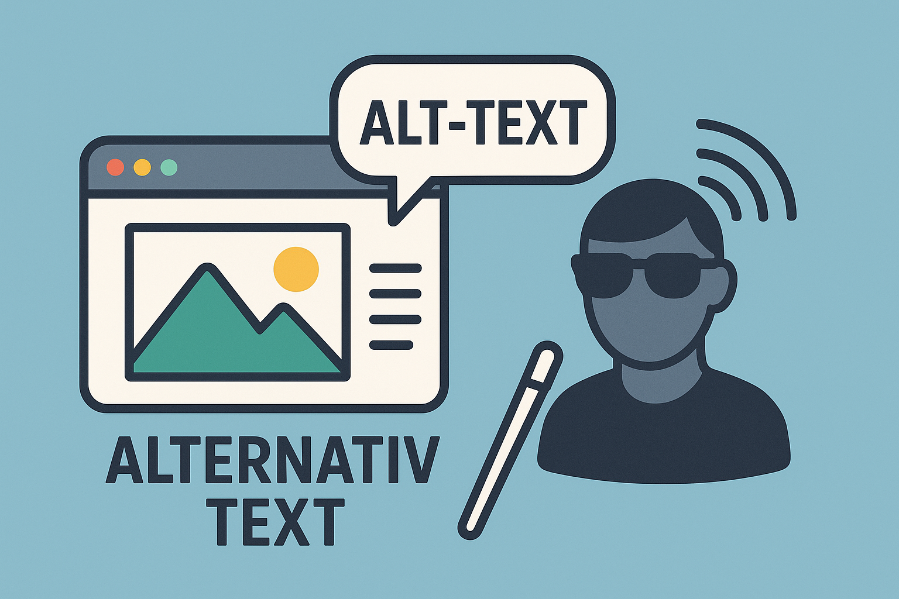
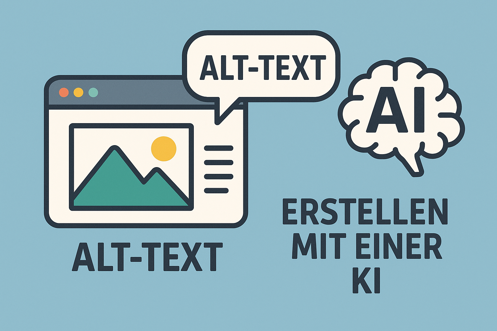
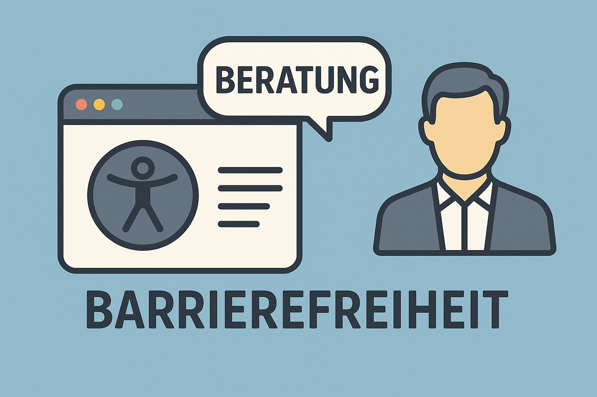

# TYPO3 Accessibility Extension



## Introduction

The TYPO3 Accessibility Extension provides tools and features to improve the accessibility of your TYPO3 website. It helps you comply with accessibility standards and regulations by providing features for creating accessibility declarations and managing alternative texts for images.

## Features

### Barrier-Free Content Element (BarrierefreiheitErklaerung)

The extension provides a content element for creating accessibility declarations for your website:



The content element includes:

- Contact information fields (name, address, phone, email, contact form link)
- Fields for describing non-barrier-free content
- Fields for explaining economic unreasonableness
- Fields for providing enforcement body address
- Help texts for each section to guide users in creating compliant declarations

This feature helps you create a comprehensive accessibility declaration that complies with legal requirements.

### Image Alternative Text Management

The extension provides a backend module for finding and managing images without alternative text:



The module allows you to:

- Find images without alternative text
- View image information (file identifier, title, reference count)
- Add alternative text to images

This feature helps you improve the accessibility of your website by ensuring that all images have appropriate alternative text.

## Planned AI Features

The extension plans to integrate AI features for automatically generating alternative texts for images:



The planned AI features will:

- Analyze images to understand their content
- Use the context of your website to generate appropriate alternative texts
- Save time and effort in creating alternative texts
- Improve the accessibility of your website

Additionally, external services for checking the accessibility of your website are planned:



These services will:

- Check your website for accessibility issues
- Provide feedback on the accessibility status
- Help you improve the accessibility of your website

## Installation

1. Install the extension via Composer:
   ```
   composer require 4viewture/accessibility
   ```

2. Activate the extension in the Extension Manager.

3. Include the static TypoScript template in your site template.

## Usage

### Creating an Accessibility Declaration

1. Create a new content element on a page.
2. Select "Barrier Free Content" from the "Special Elements" tab.
3. Fill in the required fields:
   - Contact information
   - Description of non-barrier-free content (if applicable)
   - Explanation of economic unreasonableness (if applicable)
   - Address of the enforcement body
4. Save and publish the content element.

### Managing Alternative Texts for Images

1. Go to the "Accessibility" module in the TYPO3 backend.
2. Click on "Find and create alternative texts for images".
3. View the list of images without alternative text.
4. Click on an image to add an alternative text.
5. Save the changes.

## Support and Contribution

For support and contribution, please contact:

- Website: [https://4viewture.de](https://4viewture.de)
- Email: [info@4viewture.de](mailto:info@4viewture.de)

## License

This extension is released under the [GPL-2.0-or-later](https://www.gnu.org/licenses/gpl-2.0.html) license.